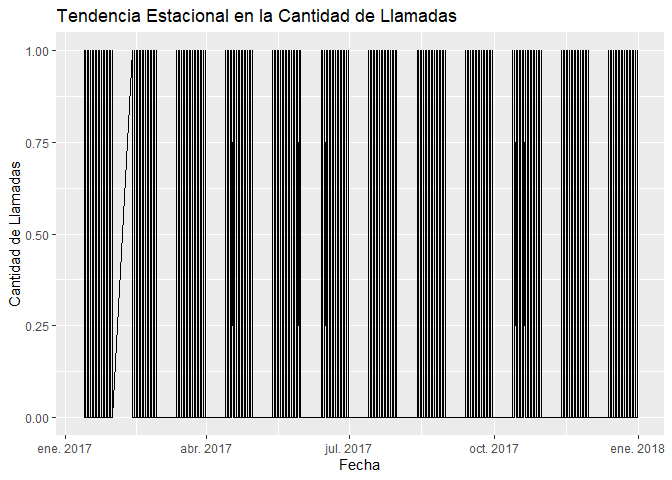
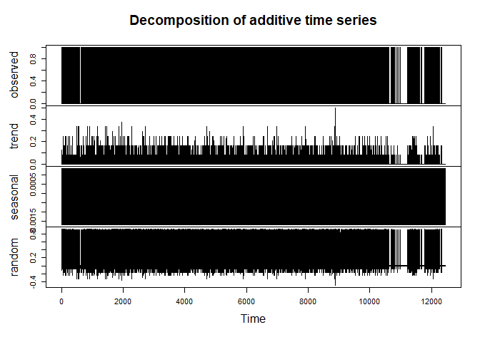

Laboratorio 5
================
Keneth Ruiz
2023-09-26

``` r
library(lubridate)
```

    ## 
    ## Attaching package: 'lubridate'

    ## The following objects are masked from 'package:base':
    ## 
    ##     date, intersect, setdiff, union

``` r
library(readxl)
library(dplyr)
```

    ## 
    ## Attaching package: 'dplyr'

    ## The following objects are masked from 'package:stats':
    ## 
    ##     filter, lag

    ## The following objects are masked from 'package:base':
    ## 
    ##     intersect, setdiff, setequal, union

``` r
library(nycflights13)
library(ggplot2)
library(forecast)
```

    ## Registered S3 method overwritten by 'quantmod':
    ##   method            from
    ##   as.zoo.data.frame zoo

## Parte 1

``` r
eclipse_inicial <- dmy_hms('21 aug 2017 18:26:40')
synodic_month <- days(29)+hours(12)+minutes(44)+seconds(3)
saros <- synodic_month * 223

prox_eclipse <- eclipse_inicial %m+% saros
prox_eclipse
```

    ## [1] "2035-09-02 02:09:49 UTC"

### PARTE 2

``` r
#Pura limpieza de datos con las fechas
data <- read_excel("data.xlsx")
data <- data[data$Cod != 0,]
convertir_fecha <- function(fecha) {
  tryCatch(
    {
      return(as.Date(fecha, format = "%d-%m-%y"))
    },
    error = function(e) {
      return(NA)  
    }
  )
}
data$`Fecha Creación` <- convertir_fecha(data$`Fecha Creación`)
data$`Fecha Final` <- convertir_fecha(data$`Fecha Final`)
data <- data[!is.na(data$`Fecha Creación`), ]
```

``` r
#Pregunta 2.1
meses_con_mas_llamadas <- data %>%
  group_by(Cod, Mes = month(`Fecha Creación`, label = TRUE)) %>%
  summarize(Cantidad = sum(Call), .groups = "drop") %>%
  arrange(Cod, desc(Cantidad))
print(meses_con_mas_llamadas)
```

    ## # A tibble: 72 × 3
    ##    Cod                          Mes   Cantidad
    ##    <chr>                        <ord>    <dbl>
    ##  1 Actualización de Información may        314
    ##  2 Actualización de Información mar        306
    ##  3 Actualización de Información dic        300
    ##  4 Actualización de Información ago        298
    ##  5 Actualización de Información oct        290
    ##  6 Actualización de Información jul        289
    ##  7 Actualización de Información nov        289
    ##  8 Actualización de Información ene        284
    ##  9 Actualización de Información sep        272
    ## 10 Actualización de Información jun        265
    ## # ℹ 62 more rows

``` r
# Pregunta 2.2: Qué día de la semana es el más ocupado
dia_ocupado <- data %>%
  mutate(dia_semana = weekdays(`Fecha Creación`)) %>%
  group_by(dia_semana) %>%
  summarize(Cantidad = n(), .groups = 'drop') %>%
  arrange(desc(Cantidad))

# Imprimir los resultados en la terminal
print(dia_ocupado)
```

    ## # A tibble: 7 × 2
    ##   dia_semana Cantidad
    ##   <chr>         <int>
    ## 1 lunes         21715
    ## 2 viernes       21671
    ## 3 martes        21618
    ## 4 jueves        21582
    ## 5 sábado        21074
    ## 6 miércoles     20974
    ## 7 domingo       20870

``` r
# Pregunta 2.3: Qué mes es el más ocupado
meses_ocupados <- data %>%
  group_by(Mes = month(`Fecha Creación`, label = TRUE)) %>%
  summarize(Cantidad = n()) %>%
  arrange(desc(Cantidad))

# Imprimir los resultados en la terminal
print(meses_ocupados)
```

    ## # A tibble: 12 × 2
    ##    Mes   Cantidad
    ##    <ord>    <int>
    ##  1 oct      12953
    ##  2 ene      12951
    ##  3 mar      12946
    ##  4 may      12885
    ##  5 jul      12832
    ##  6 dic      12825
    ##  7 ago      12804
    ##  8 sep      12315
    ##  9 nov      12217
    ## 10 abr      12210
    ## 11 jun      11983
    ## 12 feb      10583

``` r
#pregunta 2.4 Crear un gráfico de líneas para visualizar tendencias estacionales
ggplot(data, aes(x = `Fecha Creación`, y = Call)) +
  geom_line() +
  labs(
    title = "Tendencia Estacional en la Cantidad de Llamadas",
    x = "Fecha",
    y = "Cantidad de Llamadas"
  )
```

<!-- -->

``` r
# Realizar un análisis de descomposición de series temporales
library(forecast)

ts_data <- ts(data$Call, frequency = 12)  # Suponiendo datos mensuales
decomp <- decompose(ts_data)

# Visualizar los componentes de la descomposición
plot(decomp)
```

<!-- -->

``` r
# Pregunta 2.5: Cuántos minutos dura la llamada promedio
data$duracion <- as.numeric(difftime(data$`Hora Final`, data$`Hora Creación`, units = "mins"))
duracion_promedio <- mean(data$duracion[data$Call == 1], na.rm = TRUE)  
cat("La llamada promedio dura:", duracion_promedio, "minutos\n")
```

    ## La llamada promedio dura: 14.61654 minutos

``` r
# Redondear la duración de llamadas al minuto más cercano
data$duracion_minutos <- round(data$duracion)

# Crear una tabla de frecuencias
tabla_frecuencias <- table(data$duracion_minutos)

# Convertir la tabla en un data frame
df_tabla_frecuencias <- as.data.frame(tabla_frecuencias)

# Renombrar las columnas
colnames(df_tabla_frecuencias) <- c("Tiempo de Llamada en Minutos", "Cantidad de Llamadas")

# Imprimir la tabla de frecuencias
print(df_tabla_frecuencias)
```

    ##    Tiempo de Llamada en Minutos Cantidad de Llamadas
    ## 1                             0                 5439
    ## 2                             1                 4909
    ## 3                             2                 4865
    ## 4                             3                 4832
    ## 5                             4                 4828
    ## 6                             5                 4800
    ## 7                             6                 4945
    ## 8                             7                 4734
    ## 9                             8                 4894
    ## 10                            9                 4786
    ## 11                           10                 4708
    ## 12                           11                 4772
    ## 13                           12                 4763
    ## 14                           13                 4876
    ## 15                           14                 4848
    ## 16                           15                 4927
    ## 17                           16                 4775
    ## 18                           17                 4941
    ## 19                           18                 4714
    ## 20                           19                 4736
    ## 21                           20                 4872
    ## 22                           21                 4612
    ## 23                           22                 4718
    ## 24                           23                 4835
    ## 25                           24                 4837
    ## 26                           25                 4634
    ## 27                           26                 4832
    ## 28                           27                 4853
    ## 29                           28                 4679
    ## 30                           29                 4761
    ## 31                           30                 4779

### PARTE 3

``` r
#Pregunta 3.1
obtener_signo_zodiacal_iso <- function(fecha_nacimiento) {
  fecha <- ymd(fecha_nacimiento)
  mes_dia <- month(fecha) * 100 + day(fecha)
  
  if ((mes_dia >= 321 && mes_dia <= 419)) {
    return("Aries")
  } else if (mes_dia >= 420 && mes_dia <= 520) {
    return("Tauro")
  } else if (mes_dia >= 521 && mes_dia <= 620) {
    return("Géminis")
  } else if (mes_dia >= 621 && mes_dia <= 722) {
    return("Cáncer")
  } else if (mes_dia >= 723 && mes_dia <= 822) {
    return("Leo")
  } else if (mes_dia >= 823 && mes_dia <= 922) {
    return("Virgo")
  } else if (mes_dia >= 923 && mes_dia <= 1022) {
    return("Libra")
  } else if (mes_dia >= 1023 && mes_dia <= 1121) {
    return("Escorpio")
  } else if (mes_dia >= 1122 && mes_dia <= 1221) {
    return("Sagitario")
  } else if (mes_dia >= 1222 || mes_dia <= 119) {
    return("Capricornio")
  } else if (mes_dia >= 120 && mes_dia <= 218) {
    return("Acuario")
  } else {
    return("Piscis")
  }
}

fecha_nacimiento_iso <- "2001-04-06" # Poner fecha de nacimiento en Formato ISO como fue visto en clase.
signo_iso <- obtener_signo_zodiacal_iso(fecha_nacimiento_iso)
cat("Tu signo zodiacal es:", signo_iso, "\n")
```

    ## Tu signo zodiacal es: Aries

\#Parte 4

``` r
# Parte 4.1
formateo <- function(year, month, day, ttime) {
  paste(year, month, day, ttime %/% 100, ttime %% 100, sep = ":")
}
cols <- flights %>% 
  mutate(deptime = formateo(year, month, day, dep_time),
         arrtime = formateo(year, month, day, arr_time),
         schdarr = formateo(year, month, day, sched_arr_time),
         schdep = formateo(year, month, day, sched_dep_time))

# Selecciona las columnas deseadas
cols %>% select(carrier, deptime, arrtime, schdarr, schdep)
```

    ## # A tibble: 336,776 × 5
    ##    carrier deptime       arrtime       schdarr        schdep       
    ##    <chr>   <chr>         <chr>         <chr>          <chr>        
    ##  1 UA      2013:1:1:5:17 2013:1:1:8:30 2013:1:1:8:19  2013:1:1:5:15
    ##  2 UA      2013:1:1:5:33 2013:1:1:8:50 2013:1:1:8:30  2013:1:1:5:29
    ##  3 AA      2013:1:1:5:42 2013:1:1:9:23 2013:1:1:8:50  2013:1:1:5:40
    ##  4 B6      2013:1:1:5:44 2013:1:1:10:4 2013:1:1:10:22 2013:1:1:5:45
    ##  5 DL      2013:1:1:5:54 2013:1:1:8:12 2013:1:1:8:37  2013:1:1:6:0 
    ##  6 UA      2013:1:1:5:54 2013:1:1:7:40 2013:1:1:7:28  2013:1:1:5:58
    ##  7 B6      2013:1:1:5:55 2013:1:1:9:13 2013:1:1:8:54  2013:1:1:6:0 
    ##  8 EV      2013:1:1:5:57 2013:1:1:7:9  2013:1:1:7:23  2013:1:1:6:0 
    ##  9 B6      2013:1:1:5:57 2013:1:1:8:38 2013:1:1:8:46  2013:1:1:6:0 
    ## 10 AA      2013:1:1:5:58 2013:1:1:7:53 2013:1:1:7:45  2013:1:1:6:0 
    ## # ℹ 336,766 more rows

``` r
#Parte 4.2

delays <- flights %>%  select(flight ,dep_delay,arr_delay) %>% 
  mutate(totalDelay= minutes(dep_delay+arr_delay)) %>% 
  select(flight,totalDelay)


head(delays)
```

    ## # A tibble: 6 × 2
    ##   flight totalDelay
    ##    <int> <Period>  
    ## 1   1545 13M 0S    
    ## 2   1714 24M 0S    
    ## 3   1141 35M 0S    
    ## 4    725 -19M 0S   
    ## 5    461 -31M 0S   
    ## 6   1696 8M 0S
